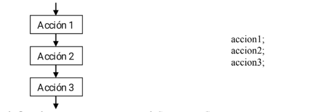
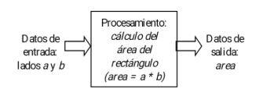
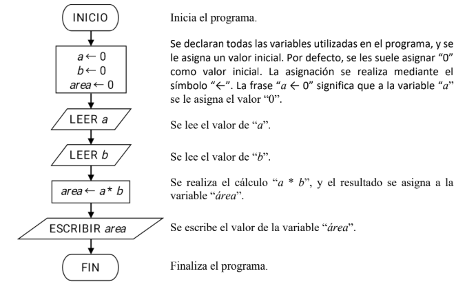

# Laboratorio de programación (2025)
## Módulo N°1: Estructuras secuenciales.

Las estructuras secuenciales son aquellas en las que una acción (instrucción) sigue otra en una secuencia. En una estructura secuencial, una acción no se realiza hasta que se haya completado la anterior. En general, las tareas se suceden de tal modo que la salida de una es la entrada de la siguiente, y así sucesivamente hasta el final del proceso.

A continuación, se muestra el diagrama de flujo y su sintaxis en `C++` de una estructura secuencial:



*Diagrama de flujo de una estructura secuencial* *Sintaxis en C++ en una estructura secuencial.*

Para comprender como se realiza la aplicación de esta estructura para resolver problemas, se muestra a continuación un ejemplo:

**Ejemplo:** Se desea realizar un algoritmo que permita calcular el área de un rectángulo a partir de sus lados `a` y `b`. Los valores de los lados del rectángulo se deben ingresar por teclado, y el resultado se debe imprimir en pantalla. Realizar el diagrama de flujo y programa en `C++` del algoritmo.

**Solución:** A continuación, se muestra un esquema donde se ilustran los datos de entrada, el procesamiento de los datos, y los datos de salida del algoritmo:



El algoritmo deberá, en primera instancia, declarar todas las variables que se van a utilizar (`a`, `b` y `área`). Luego, deberá leer los datos de entrada, realizar los cálculos necesarios, y escribir el resultado. El drigrama de flujo del algoritmo es el siguiente:



***Diagrama de flujo del algoritmo*

Una vez realizado el diagrama de flujo del algoritmo, se deberá expresar en un lenguaje de programación. El programa pedido por la consigna es el `C++`.

```C++
    #include <iostream>  /*Añade la librería "stream input-output" que contiene operaciones de entrada/salida tales como "cin" y "cout"*/
        using namespace std;  /*"using namespace std" significa el uso de nombre en el espacio de estandar esta linea de codigo nos permite utilizar el "cin y cout* sin poner "std::"*/
        int main(){  /*"main" es la función principal, donde está alojado el programa principal, cuya entrada es nula ("void") y su salida es un enetero "int".*/
            float a=0, b=0, area=0; /*Declara las variables en coma flotante "a", "b" y "area", y les asigna el valor de "0"*/
            cin>>a;  /*Ingrese un número por teclado y lo lmacena en la variable "a".*/
            cin>>b;/*Ingrese un número por teclado y lo almacena en la variable "b".*/
            area=a*b;/*Realiza el cálculo "a * b" y el resultado lo almacena en la variable "area"*/
            cout<<area; /*Imprime en pantalla el valor almacena la variable "area".*/
            return 0; /*Devuelve un "0" como resultado de la función principal "main". Esto indica que el programa se ejecuto correctamente*/
        }
```
*Programa en `C++` del algoritmo.*

Todo el texto verde entre los símbolos `/*` y `*/` son comentarios. No son parte del programa, y hacen una descripción de lo que realiza cada instrucción. Son muy  útiles para no olvidar la estructura lógica del algoritmo.

Es preciso tener en cuenta la sintaxis del programa anterior, tales como los `;` al final de cada sentencia, las llaves `{` y `}` que indican el principio y fin del programa principal, los paréntesis `(` y que indican el principio y fin de los argumentos en las funciones, y las comas `,` que separan los argumentos, entre otras reglas.

Es muy importante respectar todass estas reglas de sintaxis del lenguaje `C++`, sino el programa no se compilará y no se podrá ejecutar.

<hr>

## Ejercicios:

1. Diseñar un algoritmo que calcule el perímetro y el área de un círculo a partir del valor de su radio. El valor del radio se debe ingresar por teclado, y los valores del perímetro y el área calculados se deben imprimir en pantalla. Dibujar el diagrama de flujo y escribir el programa en `C++` del algoritmo.

*Ayuda: recordar que el perímetro `P` y el área `A` de un círculo de radio `r` se calculan:*

P = 2 * 𝜋 * r   y  A = 𝜋 * r²

### Video ilustrativo.

<video src="Videos/video1.mp4" controls=""></video>

<hr>

2. Diseñar un algoritmo que permita calcular la resistencia equivalente de dos resistencias en paralelo R1 y R2. Los valores de las resistencias se deben ingresar por teclado, y el resultado de la resistencia equivalente se debe imprimir en pantalla. Dibujar el diagrama de flujo y escribir el programa en `C++` del algoritmo.

*Ayuda: recordar que la resistencia equivalente de dos resistencias en paralelo se calcula mediante la expresión: *
<br>

 **Req =   (R1 * R2) / (R1+R2)** 

 ### Video ilustrativo.

 <video src="Videos/video2.mp4" controls=""></video>
​
<hr>

3. Diseñar un algoritmo que calcule la suma de dos números enteros. Los números enteros se deben ingresar por teclado, y el resultado de la suma se debe imprimir en pantalla. Dibujar el diagrama de flujo y escribir el programa en `C++` del algoritmo.

*Ayuda: para declarar variables enteras se puede utilizar la siguiente instrucción:*

```C++
    int a; /* Declara la variable entera "a". */
```

### Video ilustrativo.

<video src="Videos/video3.mp4" controls=""></video>

<hr>

4. Diseñar un algoritmo que calcule la hipotenusa de un triagulo rectángulo a partir del valor de sus catetos. Los valores de los catetos se deben ingresar por teclado, y el valor de la hipotenusa calculada se debe imprimir en pantalla. Dibujar el diagrama de flujo y escribir el programa en `C++` del algoritmo.

*Ayuda 1: recordar que la hipotenusa `h` de un triángulo rectángulo con catetos `a` y `b` se calculan: * 
<br>


*Ayuda 2: en `C++` se pueden calcular potencias y raíces cuadradas con las funciones `pow()` y `sqrt()`, que se encuentra en la librería `math.h`. Esta librería se puede incluir agregando, al inicio del programa, la instrucción:*

```C++
#include <math.h>
```

*Ayuda 3: en el siguiente ejemplo se ilustra como se calculan cuadrados utilizando la instrucción `pow()`:*

```C++
cuadrado = pow(numero, 2); /* Esta instrucción calcula el cuadrado del valor dentro de la variable `numero`, y el resultado lo almacena en la variable `cuadrado`. */
```

*Ayuda 4: en el siguiente ejemplo se ilustra como se calculan raíces cuadradas utilizando la instrucción `sqrt()`:*

```C++
    raiz = sqrt(numero); /* Esta instrucción calcula la raíz cuadrada del valor dentro de la variable "numero", y el resultado lo almacena en la variable "rai". */
```

<hr>

5. Diseñar un algoritmo que pregunte el nombre al usuario, y luego devuelva un saludo junto con el nombre. El nombre del usuario se debe ingresar por teclado, y el saludo se debe imprimir en pantalla. Dibujar el diagrama de flujo y escribir el programa en `C++` del algoritmo.

*Ayuda: para declarar una variable `char` que almacene una cadena de caraacteres, se puede utilizar la siguiente instrucción: *

```C++
char nombre[20]; /* Esta instrucción declara la variable "nombre" con espacio para 20 caracteres */
```

### Video ilustrativo.

<video src="Videos/video4.mp4" controls=""></video>

<hr>